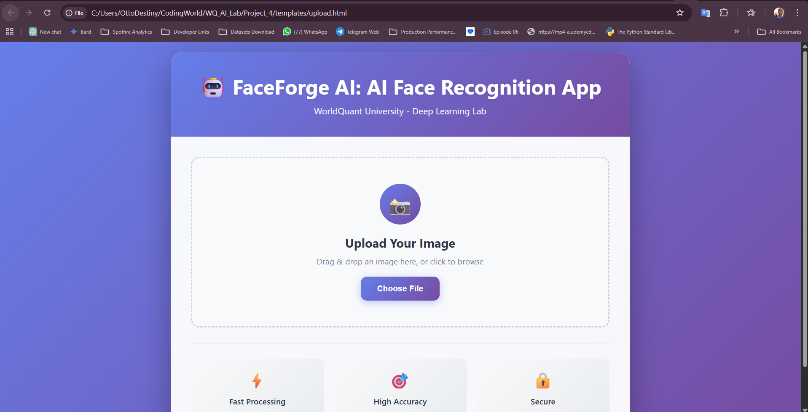
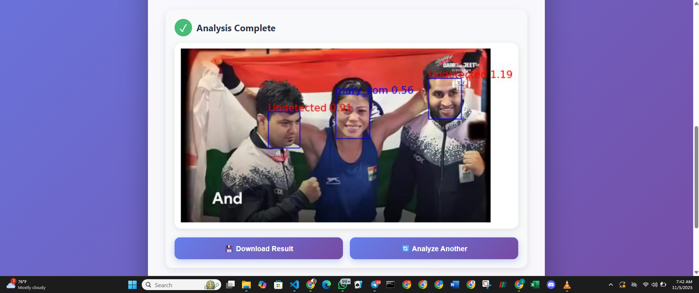

<p align="center">
  
  
  
  
  
  
  
  
  
</p>

# FaceForge AI: AI Face Recognition App




A full-stack Deep Learning web application for real-time face detection and recognition. This project was developed as part of the WorldQuant University AI Lab: Deep Learning for Computer Vision.

This application uses a powerful deep learning pipeline to perform two key tasks:

* **Face Detection:** It identifies and draws bounding boxes around all human faces in a user-uploaded image.
* **Face Recognition:** It identifies specific, pre-trained individuals and labels them accordingly.

The model is specifically trained to recognize Indian boxer Mary Kom and her interviewer. All other detected faces are labeled as "Undetected".

---

## 📸 Application Showcase

### Main Upload Interface

The app features a clean, responsive, and user-friendly interface for uploading images via drag-and-drop or a standard file browser.

### Analysis Result

After processing, the app displays the original image annotated with bounding boxes and labels. Recognized individuals are labeled in blue, while "Undetected" faces are labeled in red.


---

## ✨ Key Features

* **Modern Web Interface:** A clean and responsive front-end built with HTML5, CSS3, and vanilla JavaScript.
* **Drag & Drop Upload:** Easily upload images by dragging them onto the page.
* **Image Preview:** Users can preview their selected image and file details (name, size, type) before analysis.
* **Robust Flask Backend:** A secure and efficient backend built with Flask, handling file validation, processing, and API endpoints.
* **High-Accuracy Detection:** Utilizes a Multi-Task Cascaded Convolutional Network (MTCNN) to accurately detect all faces and their bounding boxes.
* **Deep Learning Recognition:** Employs a pre-trained InceptionResnetV1 model (from the VGGFace2 dataset) to generate unique facial embeddings (vectors).
* **Custom Recognition:** Compares detected faces against a custom-built database (embeddings.pt) to identify known individuals.
* **Downloadable Results:** Users can download the final annotated image with one click.

---

## 🛠️ Technology Stack

### Backend & Machine Learning

* **Python 3:** Core programming language.
* **Flask:** Micro-framework for the web server, API routes (/, /recognize), and error handling.
* **PyTorch:** The primary deep learning framework.
* **facenet-pytorch:** A library providing efficient PyTorch implementations of MTCNN (for detection) and InceptionResnetV1 (for recognition).
* **PIL (Pillow):** For opening and manipulating image data.
* **Matplotlib:** Used to draw the final image with bounding boxes and labels.

### Frontend

* **HTML5:** Structures the web application.
* **CSS3:** Styles the application for a modern, responsive look.
* **JavaScript (ES6+):** Handles all client-side logic, including file uploads, drag-and-drop, API communication (fetch), and displaying results.

---

## 🧠 How It Works: The ML Pipeline

The core logic resides in `face_recognition.py` and is triggered by the `/recognize` route in `app.py`.

1. **Image Upload:** A user uploads an image to the Flask backend.
2. **Face Detection (`locate_faces`):**

   * The image is passed to the MTCNN model.
   * MTCNN scans the image and returns a list of bounding boxes (`boxes`), confidence probabilities (`probs`), and cropped face images (`cropped_images`) for every face it finds.
   * Faces with a confidence below 90% (`prob < 0.9`) are discarded.
3. **Embedding Generation (`determine_name_dist`):**

   * Each `cropped_image` is passed to the InceptionResnetV1 model.
   * This model converts the face into a 512-dimensional vector (an "embedding") that numerically represents its unique features.
4. **Face Comparison:**

   * This newly generated embedding is compared to all the pre-computed embeddings stored in `model/embeddings.pt`.
   * The comparison is made using Euclidean distance (`torch.dist`).
5. **Identification:**

   * The app finds the known embedding with the smallest distance to the new embedding.
   * If this distance is below a threshold (set to `0.9`), the face is identified, and the corresponding name is retrieved.
   * If the distance is above the threshold, the face is considered unknown and assigned the label "Undetected".
6. **Annotation (`label_face` & `add_labels_to_image`):**

   * A Matplotlib figure is created with the original uploaded image.
   * For each face, a colored bounding box and a text label (e.g., `Mary Kom 0.62` or `Undetected 1.15`) are drawn onto the figure.
7. **Return Result:**

   * The Matplotlib figure is saved as a JPEG image in an in-memory buffer.
   * The Flask server sends this image buffer back to the frontend, where it is displayed to the user.

---

## 📦 Project Structure

```
FaceForgeAI/
├── assets/
│   ├── upload_screenshot.png     # Screenshot of the main UI
│   └── result_screenshot.png     # Screenshot of the app's output
│
├── data/
│   ├── mary_kom_sample.jpg       # Sample images used to build embeddings
│   └── interviewer_sample.jpg    #
│
├── model/
│   └── embeddings.pt             # Pre-computed PyTorch embeddings for known faces
│
├── templates/
│   └── upload.html               # The main frontend HTML file
│
├── app.py                        # Flask backend server
├── face_recognition.py           # The core ML processing script
└── README.md                     # This file
```

---

## 📊 Dataset

The recognition model (`embeddings.pt`) was trained on a small, custom dataset. The images were sourced from a video interview of the renowned Indian boxer, Mary Kom, and her interviewer. The `data/` folder contains static samples from this source. This is why the app is only configured to recognize these two specific individuals.

---

## 🚀 Getting Started

Follow these instructions to get a copy of the project up and running on your local machine.

### Prerequisites

* Python 3.8+
* pip (Python package installer)

### Installation

**Clone the repository:**

```bash
git clone https://github.com/your-username/FaceForgeAI.git
cd FaceForgeAI
```

**Create and activate a virtual environment (recommended):**

```bash
# On macOS/Linux
python3 -m venv venv
source venv/bin/activate

# On Windows
python -m venv venv
.\venv\Scripts\activate
```

**Install the required dependencies:**

```bash
pip install flask pillow torch torchvision matplotlib facenet-pytorch
```

(Note: torchvision and facenet-pytorch will handle the torch installation.)

### Running the Application

**Start the Flask server:**

```bash
python app.py
```

**Open your browser:**

```
Navigate to http://127.0.0.1:5000
```

The application should now be live.

**Use the app:**

1. Drag and drop an image file (or click "Choose File") containing faces.
2. Click the "🔍 Analyze Faces" button.
3. View the results and use the "💾 Download Result" button to save the annotated image.

---

## 🙏 Acknowledgments

Developed by **Destiny Otto**  
As part of the **WorldQuant University AI Lab: Deep Learning for Computer Vision** program.

📧 Contact: destinymanuchi.otto@gmail.com  
🌐 Linkedin: [Destiny Otto](https://linkedin.com/in/destiny-otto)


## 📜 License

The project code and framework are licensed under the **Creative Commons Attribution-NonCommercial-NoDerivatives 4.0 International License**.

To view a copy of this license, visit:
[http://creativecommons.org/licenses/by-nc-nd/4.0/](http://creativecommons.org/licenses/by-nc-nd/4.0/)


---


